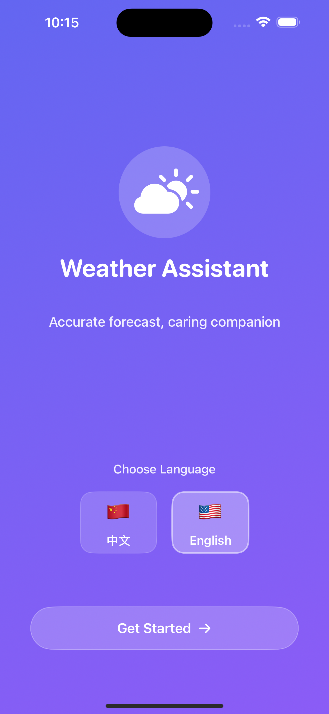

# WeathersPro Marketing Website

A beautiful, responsive marketing website for the WeathersPro iOS weather application.

🌐 **Live Demo**: [View Website](https://your-username.github.io/weatherspro-website/)



## ✨ Features

- **Modern Design** - Clean, professional design with smooth animations
- **Fully Responsive** - Perfect on desktop, tablet, and mobile devices
- **Real App Screenshots** - Showcases actual iOS app screenshots
- **SEO Optimized** - Complete with meta tags and sitemap
- **Fast Loading** - Optimized for performance
- **Privacy & Legal** - Includes privacy policy and terms of service

## 📁 File Structure

```
weatherspro-website/
├── index.html           # Main homepage
├── privacy-policy.html  # Privacy policy page
├── terms.html          # Terms of service page
├── styles.css          # All styling
├── script.js           # JavaScript functionality
├── sitemap.xml         # SEO sitemap
├── robots.txt          # Search engine instructions
└── assets/             # Images and media
    ├── logo.svg              # App logo
    ├── hero-screenshot.png   # Hero section image
    ├── screenshot-1.png      # App screenshots
    ├── screenshot-2.png
    ├── screenshot-3.png
    ├── screenshot-4.png
    ├── screenshot-5.png
    ├── screenshot-6.png
    ├── app-store-badge.png   # Download badge
    └── favicon/              # Browser icons
```

## 🚀 Quick Deploy

### Option 1: GitHub Pages

1. Fork or download this repository
2. Create a new GitHub repository
3. Push all files to your repository
4. Go to Settings → Pages
5. Select source: Deploy from branch → main → / (root)
6. Your site will be live at `https://username.github.io/repository-name/`

### Option 2: Netlify

1. Fork or download this repository
2. Log in to [Netlify](https://netlify.com)
3. Drag and drop the folder to Netlify
4. Your site will be instantly deployed

### Option 3: Vercel

1. Fork or download this repository
2. Import to [Vercel](https://vercel.com)
3. Deploy with one click

## 🎨 Customization

### Update Content

Edit `index.html` to change:
- App name and tagline
- Feature descriptions
- Download links
- Contact information

### Change Colors

Edit `styles.css` and update the gradient colors:
```css
/* Main gradient theme */
background: linear-gradient(135deg, #667eea 0%, #764ba2 100%);
```

### Replace Images

Add your images to the `assets/` folder:
- Use same filenames to auto-replace
- Or update image paths in HTML

## 📱 Screenshots

The website includes 6 real iPhone app screenshots:
1. Main weather dashboard
2. Detailed weather information
3. 7-day forecast
4. City management
5. Settings & preferences
6. Language selection

## 🛠️ Technologies

- **HTML5** - Semantic markup
- **CSS3** - Modern styling with animations
- **JavaScript** - Smooth interactions
- **No frameworks** - Pure vanilla code for simplicity

## 📄 License

This website template is provided as-is for the WeathersPro app.

## 🤝 Support

For questions about the website:
- Open an issue in this repository
- Email: support@weatherspro.com

---

Made with ❤️ for WeathersPro